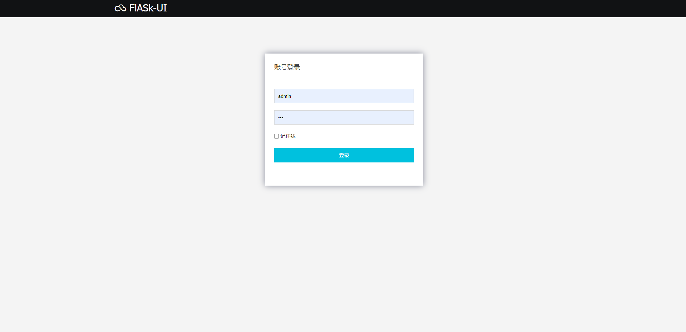

# Flask UI 脚手架

由于使用模板jinjia2编写的。前后混写，目前已不适应当前模式

1. 前后混写
1. flask框架+bootstrap+sqlaclchemy插件

目前已不再维护。

1. 不主流
1. 无法适用快速开发、敏捷开发体系中

教程：

- 第一次加载库+db初始化
```
pip install -r requirements.txt
python manage.py db init
python manage.py deploy
```

- 启动
python manage.py runserver


部署：
1. 可使用wsgi 搭配 apache 部署

效果：





